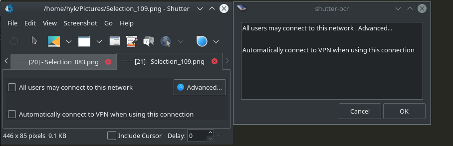

# shutter-ocr
shutter-ocr is a Tesseract based OCR plugin for Shutter. 



## Installation
```bash
sudo apt-get update;
sudo apt-get install shutter;
sudo apt-get install tesseract-ocr;

```

Change to the download folder or clone the repositroy with;
```bash
git clone https://github.com/hyucek/shutter-ocr
cd shutter-ocr
```

Continue the installation;
```
sudo ./setup.sh 
```

## Usage tips
Shutter can be run in "Draw a rectangle..." mode with 
```bash
shutter -s
```
